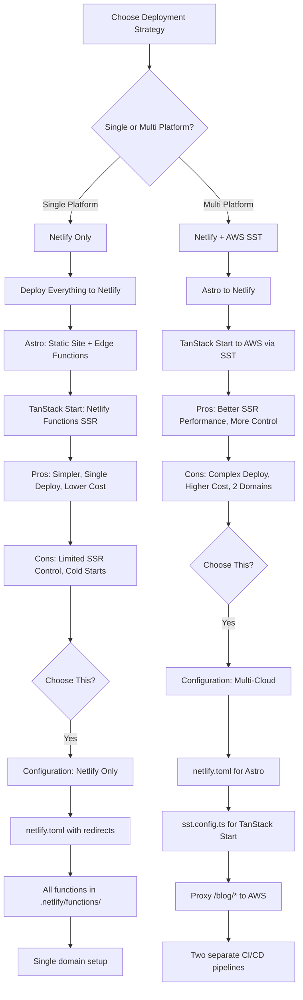

# Remediation Plan: 001-Modern-Portfolio Analysis Findings

**Generated**: 2025-11-04  
**Analysis Context**: Post `/speckit.analyze` cross-artifact consistency check  
**Status**: Ready for implementation via Orchestrator mode

---

## 1. Sample Clarification Questions for `[NEEDS CLARIFICATION]` Requirements

### FR-017: Bookings Link (Optional scheduling)

**Question**: Should the portfolio include a booking/scheduling integration for consultation calls?

**Options**:
- **A. Yes - Full Integration**: Integrate with Calendly/Cal.com for automated scheduling
  - Requires: Embed widget, API integration for availability sync
  - Benefit: Reduces friction for potential clients to book calls
  - Tradeoff: +15-20KB JS, third-party dependency
  
- **B. Yes - Simple Link**: Add a "Schedule a Call" link to external booking page
  - Requires: Button/link component only
  - Benefit: Minimal implementation, no performance impact
  - Tradeoff: Less integrated experience
  
- **C. No**: Contact form only, manual scheduling
  - Requires: No additional work
  - Benefit: Simplest approach, no external dependencies
  - Tradeoff: Manual follow-up required

**Recommended Decision**: Option B (simple link) - balances user convenience with performance/simplicity

**Spec Update if Yes**:
```markdown
- FR-017: The site MUST provide a "Schedule a Call" link/button that opens [Calendly/Cal.com/other] in a new tab for consultation booking.
```

---

### FR-018: Analytics (Privacy-preserving page views)

**Question**: What analytics tracking should be implemented, and which tool should be used?

**Options**:
- **A. Plausible Analytics**: Privacy-first, GDPR-compliant, <1KB script
  - Tracks: Page views, referrers, devices, no cookies
  - Cost: $9/mo (10K pageviews), self-hostable
  - Benefit: Privacy-compliant, no consent banners needed
  
- **B. Google Analytics 4**: Industry standard, free
  - Tracks: Everything (configurable)
  - Cost: Free
  - Tradeoff: Requires cookie consent, privacy concerns, heavier script
  
- **C. Netlify Analytics**: Server-side, no JS required
  - Tracks: Page views, referrers (server logs only)
  - Cost: $9/mo
  - Benefit: Zero performance impact, privacy-first
  
- **D. No Analytics**: No tracking
  - Benefit: Simplest, no privacy concerns
  - Tradeoff: No data-driven insights

**Recommended Decision**: Option A (Plausible) or C (Netlify) - both privacy-first and performant

**Spec Update if Yes**:
```markdown
- FR-018: The site MUST integrate Plausible Analytics for privacy-preserving page view tracking without cookies or personal data collection. Analytics script MUST be <5KB and not block page rendering.
```

---

### FR-019: Testimonial Permissions (Attribution requirements)

**Question**: How should testimonial attribution and permissions be managed?

**Options**:
- **A. Explicit Permission Required**: Each testimonial requires written consent for public attribution
  - Data model: `Testimonial.permissionGranted: boolean`, `Testimonial.consentDate: Date`
  - Display logic: If `permissionGranted === false`, show "Anonymous Senior Engineer at Healthcare Tech Company"
  - Process: Email confirmation workflow before adding to site
  
- **B. Assume Permission if Provided**: Use full attribution for all provided testimonials
  - Simpler: No permission tracking required
  - Risk: Legal/privacy concerns if someone objects
  
- **C. No Testimonials**: Remove testimonial feature entirely
  - Simplest: No complexity
  - Tradeoff: Loses trust-building element

**Recommended Decision**: Option A (explicit permission) - legally safe and professionally appropriate

**Spec Update**:
```markdown
- FR-019: Testimonials MUST include a `permissionGranted` boolean flag. When `true`, display full attribution (name, role, organization). When `false`, display anonymized title (e.g., "Senior Engineer at Healthcare Tech Company") without name or identifiable organization. The site MUST maintain a record of consent date for each testimonial.
```

**Additional Data Model**:
```typescript
interface Testimonial {
  // ... existing fields
  permissionGranted: boolean;
  consentDate?: Date; // ISO 8601 string
  anonymizedTitle?: string; // Used when permissionGranted === false
}
```

---

## 2. Specific Task Breakdowns (5-Task Subtasks)

### A. Internationalization (i18n) Implementation Tasks

**Replace**: T031 "Add internationalization support for hero and contact sections"  
**With**: 5 specific subtasks

```markdown
### Internationalization Setup

- [ ] T031-1 [P] Setup react-i18next with Astro i18n routing
  - Install: `react-i18next`, `i18next`, `@astrojs/i18n`
  - Configure: `astro.config.mjs` with `i18n: { defaultLocale: 'en', locales: ['en', 'es'] }`
  - Create: `src/i18n/config.ts` with i18next initialization
  - Files: `astro.config.mjs`, `src/i18n/config.ts`

- [ ] T031-2 [P] Create language switcher component
  - Component: `src/components/LanguageSwitcher.astro`
  - Features: Dropdown/toggle for EN/ES selection, persist choice to localStorage
  - Styling: Tailwind CSS with shadcn/ui Button component
  - Accessibility: ARIA labels, keyboard navigation
  - Files: `src/components/LanguageSwitcher.astro`

- [ ] T031-3 [P] Implement path-based routing structure
  - Routes: `/en/[page]` and `/es/[page]` for all pages
  - Middleware: Detect browser language on first visit (navigator.language)
  - Redirect: `/` → `/en/` or `/es/` based on preference
  - Files: `src/middleware.ts`, `src/pages/en/[...slug].astro`, `src/pages/es/[...slug].astro`

- [ ] T031-4 [P] Add hreflang tags and SEO metadata
  - Component: `src/components/SEOHead.astro` with hreflang logic
  - Tags: `<link rel="alternate" hreflang="en" href="/en/about" />`
  - Sitemap: Generate separate sitemaps for EN and ES (`sitemap-en.xml`, `sitemap-es.xml`)
  - Files: `src/components/SEOHead.astro`, `src/pages/sitemap-[lang].xml.ts`

- [ ] T031-5 Externalize content to locale files
  - Structure: `src/i18n/locales/en/*.json`, `src/i18n/locales/es/*.json`
  - Namespaces: `common.json`, `hero.json`, `about.json`, `projects.json`, `contact.json`
  - Validation: Zod schemas to ensure all keys exist in both languages
  - Files: `src/i18n/locales/`, `src/i18n/schemas.ts`
```

---

### B. Animation System (Framer Motion) Implementation Tasks

**Replace**: T032 "Add animations with Framer Motion"  
**With**: 5 specific subtasks

```markdown
### Animation System Setup

- [ ] T032-1 [P] Install and configure Framer Motion
  - Install: `framer-motion` (verify ~30KB gzipped)
  - Config: `src/lib/animations/config.ts` with global spring configs
  - Performance: Verify bundle impact with `vite-plugin-bundle-analyzer`
  - Files: `package.json`, `src/lib/animations/config.ts`

- [ ] T032-2 [P] Create animation variant library
  - Variants: `fadeIn`, `slideUp`, `slideLeft`, `scale`, `stagger`
  - File: `src/lib/animations/variants.ts`
  - Example:
    ```typescript
    export const fadeIn = {
      hidden: { opacity: 0 },
      visible: { opacity: 1, transition: { duration: 0.6 } }
    };
    ```
  - Files: `src/lib/animations/variants.ts`

- [ ] T032-3 [P] Implement scroll-based parallax effects
  - Hook: `useScrollParallax()` with `useScroll()` and `useTransform()`
  - Apply to: Hero background images, section dividers
  - Performance: Use `will-change: transform` sparingly
  - Files: `src/lib/animations/useScrollParallax.ts`

- [ ] T032-4 [P] Add staggered list animations
  - Component: `AnimatedList` wrapper with `staggerChildren` delay
  - Apply to: Project cards, skills list, testimonials
  - Example:
    ```typescript
    <motion.ul variants={staggerContainer} initial="hidden" animate="visible">
      {items.map(item => <motion.li variants={fadeIn}>{item}</motion.li>)}
    </motion.ul>
    ```
  - Files: `src/components/AnimatedList.tsx`

- [ ] T032-5 Implement reduced-motion support
  - Hook: `usePrefersReducedMotion()` with `window.matchMedia('(prefers-reduced-motion: reduce)')`
  - Fallback: When true, disable animations (immediate transitions)
  - Apply globally: Pass to all motion components via context
  - Files: `src/lib/animations/usePrefersReducedMotion.ts`, `src/components/AnimationProvider.tsx`
```

---

### C. Dark Mode Implementation Tasks

**Replace**: T029 "Add responsive design with Tailwind CSS" (which incorrectly includes dark mode)  
**With**: 4 specific subtasks

```markdown
### Dark Mode System

- [ ] T-Dark-1 [P] Create theme provider with Jotai
  - Atom: `themeAtom` with type `'light' | 'dark' | 'system'`
  - Hook: `useTheme()` returning `{ theme, setTheme, resolvedTheme }`
  - System detection: Listen to `prefers-color-scheme` media query
  - Files: `src/store/theme.ts`, `src/hooks/useTheme.ts`

- [ ] T-Dark-2 [P] Build theme toggle component
  - Component: `ThemeToggle` with sun/moon icons
  - UI: shadcn/ui Button with icon transition animation
  - Location: Header/navigation bar
  - Accessibility: ARIA label "Toggle dark mode"
  - Files: `src/components/ThemeToggle.tsx`

- [ ] T-Dark-3 [P] Implement localStorage persistence
  - Logic: Save theme preference to `localStorage.theme`
  - Load: Read on mount, apply before hydration to prevent flash
  - Script: Inline blocking script in `<head>` for instant theme
  - Files: `src/layouts/BaseLayout.astro` (inline script)

- [ ] T-Dark-4 Implement CSS variable system for themes
  - Variables: Define all colors as CSS custom properties
  - Light theme: `--color-bg: 255 255 255`, `--color-text: 0 0 0`
  - Dark theme: `--color-bg: 18 18 18`, `--color-text: 255 255 255`
  - Tailwind: Use `bg-[rgb(var(--color-bg))]` syntax
  - Verify: WCAG 2.1 AA contrast in both themes
  - Files: `src/styles/themes.css`, `tailwind.config.mjs`
```

---

### D. SEO Implementation Tasks

**Replace**: T101 "SEO optimization for all pages"  
**With**: 5 specific subtasks

```markdown
### SEO Comprehensive Setup

- [ ] T-SEO-1 [P] Create SEO metadata component
  - Component: `SEOHead.astro` with props for title, description, image, type
  - Tags: `<title>`, `<meta name="description">`, `<link rel="canonical">`
  - Defaults: Fallback values for all metadata
  - Files: `src/components/SEOHead.astro`

- [ ] T-SEO-2 [P] Implement Open Graph tags
  - Tags: `og:title`, `og:description`, `og:image`, `og:url`, `og:type`
  - Twitter: `twitter:card`, `twitter:title`, `twitter:description`, `twitter:image`
  - Image: Generate OG images for each page (1200x630px)
  - Files: `src/components/SEOHead.astro`, `public/og/`

- [ ] T-SEO-3 [P] Generate sitemap with internationalization
  - Route: `/sitemap.xml` (index), `/sitemap-en.xml`, `/sitemap-es.xml`
  - Content: All public pages with `<lastmod>`, `<changefreq>`, `<priority>`
  - Hreflang: Include `xhtml:link` with alternate language URLs
  - Files: `src/pages/sitemap.xml.ts`, `src/pages/sitemap-[lang].xml.ts`

- [ ] T-SEO-4 [P] Implement canonical URL logic
  - Logic: Each page specifies its canonical URL
  - Duplicates: Handle `/` vs `/index`, `/about` vs `/about/`
  - I18n: EN pages canonical to `/en/[page]`, ES to `/es/[page]`
  - Files: `src/components/SEOHead.astro`

- [ ] T-SEO-5 Add robots.txt and meta robots tags
  - File: `public/robots.txt` with sitemap reference
  - Content:
    ```
    User-agent: *
    Allow: /
    Sitemap: https://danielvalle.dev/sitemap.xml
    ```
  - Meta: Add `<meta name="robots" content="index, follow">` to public pages
  - Files: `public/robots.txt`, `src/components/SEOHead.astro`
```

---

### E. Performance Monitoring Tasks

**Replace**: T096 "Performance optimization across all stories"  
**With**: 5 specific subtasks

```markdown
### Performance Monitoring & Optimization

- [ ] T-Perf-1 [P] Setup bundle analyzer
  - Tool: `rollup-plugin-visualizer` for Vite
  - Config: Add to `vite.config.ts` with `gzip: true`
  - Report: Generate HTML report showing bundle composition
  - Threshold: Fail build if any route exceeds 200KB gzipped
  - Files: `vite.config.ts`, `package.json` scripts

- [ ] T-Perf-2 [P] Implement code splitting strategy
  - Strategy: Route-based splitting (automatic with Astro/TanStack Router)
  - Lazy load: Non-critical components with `React.lazy()` + `Suspense`
  - Examples: Blog comments, LinkedIn data, animation-heavy components
  - Verify: Each route stays under 200KB gzipped
  - Files: Component files with dynamic imports

- [ ] T-Perf-3 [P] Setup Lighthouse CI
  - Tool: `@lhci/cli` in GitHub Actions
  - Config: `.lighthouserc.json` with performance budget assertions
  - Assertions:
    ```json
    {
      "performance": 90,
      "accessibility": 90,
      "best-practices": 90,
      "seo": 90,
      "total-blocking-time": 200,
      "largest-contentful-paint": 2500
    }
    ```
  - Files: `.github/workflows/lighthouse-ci.yml`, `.lighthouserc.json`

- [ ] T-Perf-4 [P] Implement Core Web Vitals monitoring
  - Library: `web-vitals` for client-side measurement
  - Metrics: LCP, INP, CLS, FCP, TTFB
  - Reporting: Send to Sentry or custom analytics endpoint
  - Dashboard: View metrics by route, device, time period
  - Files: `src/lib/vitals.ts`, integration with Sentry

- [ ] T-Perf-5 Configure performance budget enforcement
  - Tool: `bundlesize` package for CI checks
  - Config: `.bundlesizerc` with per-route limits
  - Example:
    ```json
    {
      "files": [
        { "path": "dist/assets/index-*.js", "maxSize": "100 kB" },
        { "path": "dist/assets/blog-*.js", "maxSize": "80 kB" }
      ]
    }
    ```
  - CI: Fail PR if budget exceeded
  - Files: `.bundlesizerc`, `.github/workflows/ci.yml`
```

---

## 3. Complete Find/Replace List for Terminology Standardization

**Execute these replacements across `spec.md`, `plan.md`, and `tasks.md`:**

### Phase 1: File Paths and URLs

| Find | Replace | Files |
|------|---------|-------|
| `app/routes/projects/` | `app/routes/case-studies/` | plan.md, tasks.md |
| `/projects/:slug` | `/case-studies/:slug` | plan.md, tasks.md |
| `projects.astro` | `case-studies.astro` | tasks.md |
| `projects/[slug].astro` | `case-studies/[slug].astro` | tasks.md |
| `src/pages/projects` | `src/pages/case-studies` | plan.md, tasks.md |

### Phase 2: Type Names and Components

| Find | Replace | Files |
|------|---------|-------|
| `ProjectCard` | `CaseStudyCard` | plan.md, tasks.md |
| `projects/` (in component paths) | `case-studies/` | tasks.md |
| `SkillsViz` | `SkillsVisualization` | tasks.md |
| `skills showcase` | `skills visualization` | spec.md, plan.md |

### Phase 3: Prose and Documentation

| Find (case-insensitive) | Replace | Files |
|-------------------------|---------|-------|
| "projects page" | "case studies page" | spec.md, plan.md, tasks.md |
| "project case study" | "case study" | spec.md, plan.md |
| "the projects" | "the case studies" | All files |

### Verification Script

After replacements, run this verification:

```bash
# Check for remaining "project" references (should be minimal)
grep -i "project" specs/001-modern-portfolio/{spec,plan,tasks}.md | grep -v "case study"

# Should only find:
# - "Project Structure" headers (acceptable)
# - "project root" (directory reference, acceptable)
# - "project type" (metadata, acceptable)
```

---

## 4. Full Monorepo Structure Diagram (Astro + TanStack Start)

```
/home/dan/code/personal/portfolio/
├── .github/
│   └── workflows/
│       ├── ci.yml                    # Lint, test, build
│       ├── lighthouse-ci.yml         # Performance checks
│       └── deploy.yml                # Netlify + SST deployment
│
├── packages/                         # Monorepo workspaces
│   ├── astro-site/                   # Main portfolio (Astro 4.x)
│   │   ├── src/
│   │   │   ├── components/
│   │   │   │   ├── Hero.astro
│   │   │   │   ├── CaseStudyCard.astro
│   │   │   │   ├── SkillsVisualization.astro
│   │   │   │   ├── LanguageSwitcher.astro
│   │   │   │   ├── ThemeToggle.tsx    # React island
│   │   │   │   └── ui/                # shadcn/ui components
│   │   │   ├── layouts/
│   │   │   │   └── BaseLayout.astro
│   │   │   ├── pages/
│   │   │   │   ├── index.astro        # Redirect to /en or /es
│   │   │   │   ├── en/
│   │   │   │   │   ├── index.astro    # EN homepage
│   │   │   │   │   ├── about.astro
│   │   │   │   │   ├── case-studies/
│   │   │   │   │   │   ├── index.astro
│   │   │   │   │   │   └── [slug].astro
│   │   │   │   │   ├── skills.astro
│   │   │   │   │   └── contact.astro
│   │   │   │   ├── es/                # ES pages (same structure)
│   │   │   │   ├── sitemap.xml.ts
│   │   │   │   ├── sitemap-[lang].xml.ts
│   │   │   │   └── api/               # Astro API routes
│   │   │   │       └── contact.ts     # Contact form handler
│   │   │   ├── i18n/
│   │   │   │   ├── config.ts
│   │   │   │   ├── locales/
│   │   │   │   │   ├── en/
│   │   │   │   │   │   ├── common.json
│   │   │   │   │   │   ├── hero.json
│   │   │   │   │   │   └── about.json
│   │   │   │   │   └── es/            # Spanish translations
│   │   │   │   └── schemas.ts         # Zod validation
│   │   │   ├── lib/
│   │   │   │   ├── animations/
│   │   │   │   │   ├── config.ts
│   │   │   │   │   ├── variants.ts
│   │   │   │   │   ├── useScrollParallax.ts
│   │   │   │   │   └── usePrefersReducedMotion.ts
│   │   │   │   └── utils/
│   │   │   ├── store/                 # Jotai atoms
│   │   │   │   └── theme.ts
│   │   │   ├── styles/
│   │   │   │   ├── global.css
│   │   │   │   └── themes.css         # Dark mode CSS variables
│   │   │   └── content/               # Astro Content Collections
│   │   │       ├── config.ts
│   │   │       ├── case-studies/      # MDX files
│   │   │       └── testimonials/      # JSON files
│   │   ├── public/
│   │   │   ├── images/
│   │   │   ├── og/                    # Open Graph images
│   │   │   ├── fonts/
│   │   │   └── robots.txt
│   │   ├── astro.config.mjs           # Astro config with i18n
│   │   ├── tailwind.config.mjs
│   │   └── package.json
│   │
│   ├── blog/                          # TanStack Start blog
│   │   ├── app/
│   │   │   ├── routes/
│   │   │   │   ├── __root.tsx         # Root layout
│   │   │   │   ├── index.tsx          # Blog listing
│   │   │   │   ├── $lang/
│   │   │   │   │   └── blog/
│   │   │   │   │       ├── index.tsx  # Blog listing by lang
│   │   │   │   │       └── $slug.tsx  # Blog post
│   │   │   │   └── api/
│   │   │   │       ├── linkedin/
│   │   │   │       │   ├── auth.ts    # OAuth flow
│   │   │   │       │   └── cross-post.ts
│   │   │   │       └── rss/
│   │   │   │           └── [lang].xml.ts
│   │   │   └── components/
│   │   │       ├── BlogPostList.tsx
│   │   │       ├── BlogPostDetail.tsx
│   │   │       └── MDXProvider.tsx
│   │   ├── server/                    # Server-side logic
│   │   │   ├── linkedin.ts
│   │   │   └── mdx-loader.ts
│   │   ├── content/
│   │   │   └── blog/
│   │   │       ├── en/                # English blog posts (MDX)
│   │   │       └── es/                # Spanish blog posts (MDX)
│   │   ├── sst.config.ts              # SST deployment config
│   │   └── package.json
│   │
│   └── shared/                        # Shared utilities
│       ├── types/
│       │   ├── CaseStudy.ts
│       │   ├── Skill.ts
│       │   ├── Testimonial.ts
│       │   ├── BlogPost.ts
│       │   ├── LinkedInProfile.ts
│       │   └── index.ts
│       ├── utils/
│       │   ├── validation.ts          # Zod schemas
│       │   └── date.ts
│       ├── components/                # Shared React components
│       │   └── ui/                    # shadcn/ui (used by both apps)
│       └── package.json
│
├── specs/                             # Feature specifications
│   └── 001-modern-portfolio/
│       ├── spec.md
│       ├── plan.md
│       ├── tasks.md
│       ├── research.md
│       ├── data-model.md
│       ├── quickstart.md
│       └── contracts/
│
├── tests/
│   ├── unit/
│   ├── integration/
│   └── e2e/
│
├── package.json                       # Root package.json (workspace)
├── pnpm-workspace.yaml                # Workspace config
├── turbo.json                         # Turborepo config (optional)
└── netlify.toml                       # Netlify config with redirects

```

### Routing Integration Strategy

**Challenge**: Two separate apps need to work as one cohesive site

**Solution**: Netlify redirects and proxy

```toml
# netlify.toml
[[redirects]]
  from = "/blog/*"
  to = "https://blog.danielvalle.dev/:splat"
  status = 200
  force = true

[[redirects]]
  from = "/*"
  to = "/index.html"
  status = 200
```

**Deployment Flow**:
1. Astro site deploys to Netlify (main domain: danielvalle.dev)
2. TanStack Start blog deploys to AWS via SST (subdomain: blog.danielvalle.dev)
3. Netlify proxy forwards `/blog/*` to TanStack Start app
4. User sees seamless experience on single domain

---

## 5. Missing Entity Definitions (Ready to Paste into spec.md)

**Location**: Add to `spec.md` section "Key Entities" (after line 129)

```markdown
### Additional Entities (Post-Analysis)

- **LinkedInProfile**: userId, displayName, headline, profileUrl, experience[], skills[], recommendations[], lastSyncedAt, cacheExpiresAt.
- **LinkedInMessage**: messageId, recipientId, subject, body, sentAt, status (pending|sent|failed), retryCount.
- **BlogComment**: commentId, postSlug, authorName, authorEmail, content, publishedAt, status (pending|approved|spam), parentCommentId (for threading).
```

**Full Updated Key Entities Section**:

```markdown
## Key Entities

- **CaseStudy**: title, role, context, problem, approach, outcomes, metrics, tags, assets (architectureDiagramImage, gallery).
- **Skill**: category, name, description, proficiency scale definition, related tags.
- **Testimonial**: quote, sourceName, roleOrRelationship, organization, permissionGranted flag, consentDate, anonymizedTitle.
- **ContactSubmission**: name, email, message, submittedAt, consent flags.
- **BlogPost**: slug, title, description, content (markdown/MDX), publishDate, lastModified, author, tags, categories, language, status (draft|published), readingTimeMinutes, linkedInArticleId, canonicalUrl, coverImage.
- **LinkedInProfile**: userId, displayName, headline, profileUrl, experience[], skills[], recommendations[], lastSyncedAt, cacheExpiresAt.
- **LinkedInMessage**: messageId, recipientId, subject, body, sentAt, status (pending|sent|failed), retryCount.
- **BlogComment**: commentId, postSlug, authorName, authorEmail, content, publishedAt, status (pending|approved|spam), parentCommentId (for threading).
```

---

## 6. Deployment Strategy Decision Tree



### Recommended Decision: **Netlify Only** (Single Platform)

**Rationale**:
1. **Simplicity**: One deployment target, one domain, one CI/CD pipeline
2. **Cost**: Netlify free tier covers portfolio needs; AWS adds minimum $5/mo
3. **Performance**: Netlify Edge Functions are sufficient for blog SSR
4. **Maintenance**: Fewer moving parts, easier troubleshooting

**Tradeoffs**:
- Slightly less SSR control vs. AWS Lambda
- Cold starts for low-traffic blog functions (acceptable for MVP)

**Implementation**:
- Both Astro and TanStack Start deployed as single Netlify site
- Astro handles `/`, `/en/*`, `/es/*`, `/case-studies/*`
- TanStack Start handles `/blog/*` via Netlify Functions
- Shared Tailwind CSS and component library

---

## Next Steps: Orchestrator Mode Workflow

### Workflow Sequence

1. **Create Remediation Branch**
   ```bash
   git checkout -b remediation/001-modern-portfolio-analysis-fixes
   ```

2. **Execute Remediation Tasks in Order**
   - Task 1: Update spec.md with clarification resolutions (FR-017, FR-018, FR-019)
   - Task 2: Update spec.md with missing entities (LinkedInProfile, LinkedInMessage, BlogComment)
   - Task 3: Execute find/replace for terminology standardization
   - Task 4: Update plan.md with monorepo structure diagram
   - Task 5: Update plan.md with deployment strategy decision
   - Task 6: Update tasks.md with expanded task breakdowns (i18n, animations, dark mode, SEO, performance)

3. **Validate Changes**
   ```bash
   # Re-run analysis to verify improvements
   bash .specify/scripts/bash/check-prerequisites.sh --require-tasks
   ```

4. **Commit and PR**
   ```bash
   git add specs/001-modern-portfolio/
   git commit -m "feat(specs): resolve analysis findings for 001-modern-portfolio

- Resolve [NEEDS CLARIFICATION] items (FR-017, FR-018, FR-019)
- Add missing entities (LinkedInProfile, LinkedInMessage, BlogComment)
- Standardize terminology (projects → case-studies)
- Clarify monorepo structure (Astro + TanStack Start)
- Expand task coverage (i18n, animations, dark mode, SEO, performance)
- Document deployment strategy (Netlify single-platform)"

   git push origin remediation/001-modern-portfolio-analysis-fixes
   ```

5. **PR Review Checklist**
   - [ ] All `[NEEDS CLARIFICATION]` resolved
   - [ ] Terminology consistent across all files
   - [ ] Task coverage gaps filled (i18n, animations, dark mode, SEO, perf)
   - [ ] Entity definitions complete
   - [ ] Architecture decisions documented
   - [ ] No constitutional violations introduced

---

## Estimated Effort

- **Clarification Decisions**: 30 minutes (review options, make decisions)
- **Spec Updates**: 1 hour (add entities, update requirements)
- **Terminology Standardization**: 30 minutes (find/replace + verification)
- **Plan Updates**: 1 hour (structure diagram, deployment strategy)
- **Task Expansion**: 1.5 hours (write 25+ new subtasks)
- **Validation**: 30 minutes (re-run analysis, verify fixes)

**Total**: ~4.5 hours for complete remediation

---

**End of Remediation Plan**