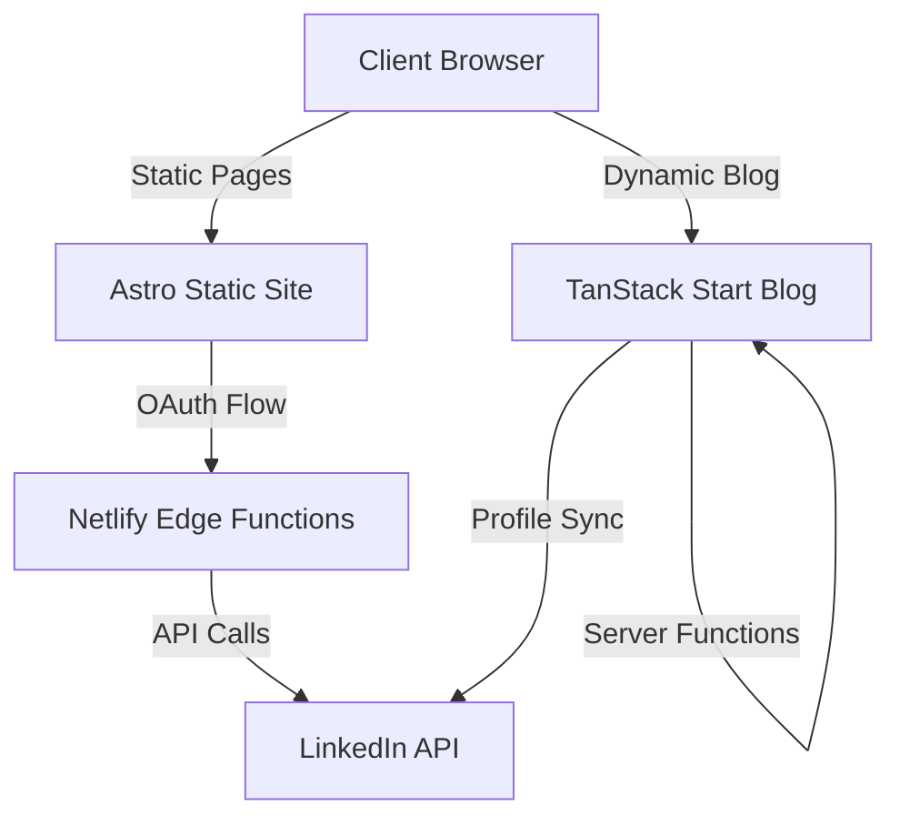
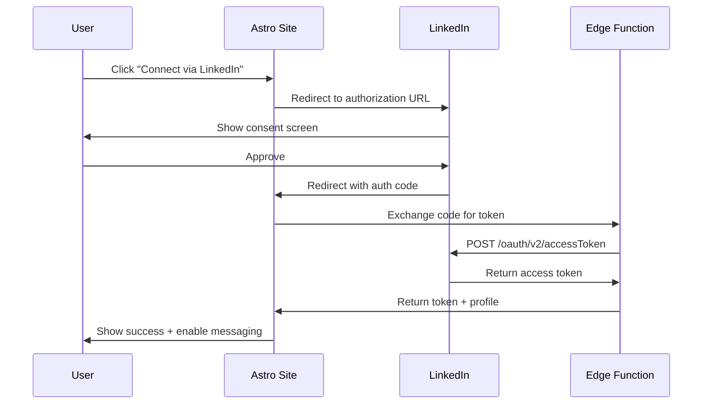

# API Contracts - Modern Portfolio

This document defines all API contracts for the Modern Portfolio hybrid architecture.

**Version**: 1.0.0  
**Last Updated**: 2025-11-03  
**Status**: Draft

---

## Table of Contents

1. [Architecture Overview](#architecture-overview)
2. [LinkedIn Integration APIs](#linkedin-integration-apis)
3. [Blog Server Functions](#blog-server-functions)
4. [Common Schemas](#common-schemas)
5. [Error Handling](#error-handling)
6. [Security & Authentication](#security--authentication)

---

## Architecture Overview

### System Components



### Technology Stack

- **Astro APIs**: Server endpoints + Netlify Edge Functions
- **TanStack Start APIs**: Server Functions with type-safe RPC
- **Authentication**: OAuth 2.0 for LinkedIn
- **Schema Validation**: Zod for runtime validation
- **API Standard**: OpenAPI 3.1.0 compatible

---

## LinkedIn Integration APIs

### 1. OAuth Authentication Flow

#### 1.1 Initialize OAuth Flow

**Endpoint**: `GET /api/auth/linkedin/init`  
**Location**: Astro server endpoint  
**Purpose**: Start LinkedIn OAuth 2.0 authorization flow

**Request**:
```typescript
// Query Parameters
interface InitOAuthRequest {
  redirect_uri?: string;  // Optional callback URL
  state?: string;         // Optional CSRF token
}
```

**Response**:
```typescript
interface InitOAuthResponse {
  authorization_url: string;  // LinkedIn auth URL to redirect to
  state: string;              // CSRF state token
}

// Example
{
  "authorization_url": "https://www.linkedin.com/oauth/v2/authorization?response_type=code&client_id=xxx&redirect_uri=xxx&state=xxx&scope=openid+profile+w_member_social+email",
  "state": "random-csrf-token-123"
}
```

**Error Responses**:
- `500 Internal Server Error`: OAuth configuration error

---

#### 1.2 OAuth Callback Handler

**Endpoint**: `GET /api/auth/linkedin/callback`  
**Location**: Astro server endpoint  
**Purpose**: Handle OAuth callback and exchange code for tokens

**Request**:
```typescript
// Query Parameters
interface OAuthCallbackRequest {
  code: string;           // Authorization code from LinkedIn
  state: string;          // CSRF state token
  error?: string;         // Error code if auth failed
  error_description?: string;
}
```

**Response**:
```typescript
interface OAuthCallbackResponse {
  success: boolean;
  access_token?: string;
  expires_in?: number;     // Token lifetime in seconds
  profile?: {
    sub: string;           // LinkedIn member ID
    name: string;
    email: string;
    picture?: string;
  };
  redirect_url: string;    // Where to redirect user
}

// Success Example
{
  "success": true,
  "access_token": "AQV8...",
  "expires_in": 5184000,
  "profile": {
    "sub": "xyz123",
    "name": "John Doe",
    "email": "john@example.com",
    "picture": "https://..."
  },
  "redirect_url": "/contact?auth=success"
}

// Error Example
{
  "success": false,
  "redirect_url": "/contact?auth=failed&reason=access_denied"
}
```

**Error Responses**:
- `400 Bad Request`: Invalid authorization code or state mismatch
- `401 Unauthorized`: LinkedIn API authentication failed
- `500 Internal Server Error`: Token exchange failed

---

### 2. LinkedIn Messaging API

#### 2.1 Send Message via Messaging API

**Endpoint**: `POST /api/linkedin/send-message`  
**Location**: Netlify Edge Function (caching layer)  
**Purpose**: Send direct message via LinkedIn Messaging API (OAuth required)

**Request**:
```typescript
interface SendMessageRequest {
  access_token: string;        // User's OAuth access token
  message: {
    subject: string;           // Message subject (max 200 chars)
    body: string;              // Message body (max 2000 chars)
    sender_email?: string;     // Optional: sender email for reference
  };
}

// Example
{
  "access_token": "AQV8...",
  "message": {
    "subject": "Portfolio Contact Request",
    "body": "Hi, I'd like to discuss a project opportunity...",
    "sender_email": "user@example.com"
  }
}
```

**Response**:
```typescript
interface SendMessageResponse {
  success: boolean;
  message_id?: string;         // LinkedIn message ID
  status: 'sent' | 'pending' | 'failed';
  error?: {
    code: string;
    message: string;
  };
}

// Success Example
{
  "success": true,
  "message_id": "urn:li:message:12345",
  "status": "sent"
}

// Error Example
{
  "success": false,
  "status": "failed",
  "error": {
    "code": "RATE_LIMIT_EXCEEDED",
    "message": "Too many requests. Please try again later."
  }
}
```

**Validation Rules** (Zod Schema):
```typescript
const SendMessageSchema = z.object({
  access_token: z.string().min(1),
  message: z.object({
    subject: z.string().min(1).max(200),
    body: z.string().min(10).max(2000),
    sender_email: z.string().email().optional()
  })
});
```

**Error Responses**:
- `400 Bad Request`: Validation error
- `401 Unauthorized`: Invalid or expired access token
- `429 Too Many Requests`: Rate limit exceeded
- `500 Internal Server Error`: LinkedIn API error

**Rate Limiting**:
- 100 messages per day per user
- 10 messages per hour per user
- Cached at edge for 5 minutes to prevent duplicate sends

---

#### 2.2 Share Content (Fallback API)

**Endpoint**: `POST /api/linkedin/share`  
**Location**: Netlify Edge Function  
**Purpose**: Fallback method using LinkedIn Share API (no OAuth required)

**Request**:
```typescript
interface ShareContentRequest {
  profile_url: string;         // LinkedIn profile URL
  message: {
    text: string;              // Pre-formatted message text
    subject?: string;          // Optional subject line
  };
}

// Example
{
  "profile_url": "https://www.linkedin.com/in/johndoe",
  "message": {
    "subject": "New Contact Request",
    "text": "Someone wants to connect via your portfolio..."
  }
}
```

**Response**:
```typescript
interface ShareContentResponse {
  success: boolean;
  share_url?: string;          // LinkedIn share URL to open
  message: string;
}

// Success Example
{
  "success": true,
  "share_url": "https://www.linkedin.com/sharing/share-offsite/?url=...",
  "message": "Redirecting to LinkedIn to share message"
}
```

**Error Responses**:
- `400 Bad Request`: Invalid profile URL
- `500 Internal Server Error`: URL generation failed

---

### 3. LinkedIn Profile Sync

#### 3.1 Fetch LinkedIn Profile

**Endpoint**: `GET /api/linkedin/profile`  
**Location**: Netlify Edge Function (cached)  
**Purpose**: Retrieve and cache LinkedIn profile data

**Request**:
```typescript
// Query Parameters
interface FetchProfileRequest {
  access_token: string;        // OAuth access token
  fields?: string;             // Comma-separated field names
}
```

**Response**:
```typescript
interface LinkedInProfileResponse {
  id: string;                  // LinkedIn member ID
  firstName: {
    localized: Record<string, string>;
  };
  lastName: {
    localized: Record<string, string>;
  };
  profilePicture?: {
    displayImage: string;
  };
  headline?: string;
  summary?: string;
  positions?: Array<{
    title: string;
    company: string;
    startDate: string;
    endDate?: string;
  }>;
  cached_at: string;           // ISO 8601 timestamp
  cache_expires_at: string;    // ISO 8601 timestamp
}
```

**Caching Strategy**:
- Cache Duration: 24 hours
- Cache Location: Netlify Edge KV store
- Cache Key: `linkedin:profile:${member_id}`

**Error Responses**:
- `401 Unauthorized`: Invalid access token
- `404 Not Found`: Profile not found
- `500 Internal Server Error`: LinkedIn API error

---

## Blog Server Functions

### 1. Blog Post Management

#### 1.1 Get Blog Posts

**Function**: `getBlogPosts`  
**Location**: TanStack Start server function  
**Purpose**: Retrieve paginated list of blog posts

**Request**:
```typescript
interface GetBlogPostsRequest {
  page?: number;               // Default: 1
  limit?: number;              // Default: 10, Max: 50
  category?: string;           // Optional filter
  tag?: string;                // Optional filter
  search?: string;             // Optional search query
  sort?: 'date' | 'title' | 'views';  // Default: 'date'
  order?: 'asc' | 'desc';      // Default: 'desc'
}
```

**Response**:
```typescript
interface GetBlogPostsResponse {
  posts: Array<{
    id: string;
    slug: string;
    title: string;
    excerpt: string;
    author: {
      name: string;
      avatar?: string;
    };
    publishedAt: string;       // ISO 8601
    updatedAt?: string;        // ISO 8601
    category: string;
    tags: string[];
    featuredImage?: string;
    readingTime: number;       // Minutes
    viewCount: number;
  }>;
  pagination: {
    page: number;
    limit: number;
    total: number;
    totalPages: number;
    hasNext: boolean;
    hasPrev: boolean;
  };
}
```

**Validation** (Zod):
```typescript
const GetBlogPostsSchema = z.object({
  page: z.number().int().positive().default(1),
  limit: z.number().int().positive().max(50).default(10),
  category: z.string().optional(),
  tag: z.string().optional(),
  search: z.string().optional(),
  sort: z.enum(['date', 'title', 'views']).default('date'),
  order: z.enum(['asc', 'desc']).default('desc')
});
```

**Error Responses**:
- `400 Bad Request`: Validation error
- `500 Internal Server Error`: Database query failed

---

#### 1.2 Get Blog Post by Slug

**Function**: `getBlogPost`  
**Location**: TanStack Start server function  
**Purpose**: Retrieve single blog post with full content

**Request**:
```typescript
interface GetBlogPostRequest {
  slug: string;
}
```

**Response**:
```typescript
interface GetBlogPostResponse {
  id: string;
  slug: string;
  title: string;
  content: string;             // MDX content
  excerpt: string;
  author: {
    name: string;
    bio?: string;
    avatar?: string;
    social?: {
      twitter?: string;
      github?: string;
      linkedin?: string;
    };
  };
  publishedAt: string;
  updatedAt?: string;
  category: string;
  tags: string[];
  featuredImage?: string;
  readingTime: number;
  viewCount: number;
  seo: {
    metaTitle?: string;
    metaDescription?: string;
    ogImage?: string;
  };
  relatedPosts?: Array<{
    id: string;
    slug: string;
    title: string;
    excerpt: string;
  }>;
}
```

**Error Responses**:
- `404 Not Found`: Post not found
- `500 Internal Server Error`: Read error

---

### 2. Comment Management

#### 2.1 Get Comments

**Function**: `getComments`  
**Location**: TanStack Start server function  
**Purpose**: Retrieve comments for a blog post

**Request**:
```typescript
interface GetCommentsRequest {
  postId: string;
  page?: number;               // Default: 1
  limit?: number;              // Default: 20
  sort?: 'date' | 'votes';     // Default: 'date'
  order?: 'asc' | 'desc';      // Default: 'desc'
}
```

**Response**:
```typescript
interface GetCommentsResponse {
  comments: Array<{
    id: string;
    postId: string;
    parentId?: string;         // For threaded replies
    author: {
      name: string;
      email: string;           // Hashed/masked
      avatar?: string;
      isVerified: boolean;
    };
    content: string;           // Sanitized HTML
    createdAt: string;
    updatedAt?: string;
    status: 'approved' | 'pending' | 'spam';
    votes: {
      up: number;
      down: number;
    };
    replies?: GetCommentsResponse['comments'];  // Nested replies
  }>;
  pagination: {
    page: number;
    limit: number;
    total: number;
    totalPages: number;
  };
}
```

**Error Responses**:
- `404 Not Found`: Post not found
- `500 Internal Server Error`: Database error

---

#### 2.2 Create Comment

**Function**: `createComment`  
**Location**: TanStack Start server function  
**Purpose**: Submit new comment (requires moderation)

**Request**:
```typescript
interface CreateCommentRequest {
  postId: string;
  parentId?: string;           // For replies
  author: {
    name: string;
    email: string;
    website?: string;
  };
  content: string;             // Max 5000 chars
  recaptchaToken: string;      // Anti-spam
}
```

**Response**:
```typescript
interface CreateCommentResponse {
  success: boolean;
  comment: {
    id: string;
    status: 'pending' | 'approved';
    message: string;
  };
}

// Example
{
  "success": true,
  "comment": {
    "id": "cmt_abc123",
    "status": "pending",
    "message": "Your comment is pending moderation"
  }
}
```

**Validation** (Zod):
```typescript
const CreateCommentSchema = z.object({
  postId: z.string().uuid(),
  parentId: z.string().uuid().optional(),
  author: z.object({
    name: z.string().min(2).max(100),
    email: z.string().email(),
    website: z.string().url().optional()
  }),
  content: z.string().min(10).max(5000),
  recaptchaToken: z.string()
});
```

**Security Features**:
- Content sanitization (DOMPurify)
- reCAPTCHA v3 validation
- Rate limiting (3 comments per hour per IP)
- Spam detection (Akismet-style filtering)

**Error Responses**:
- `400 Bad Request`: Validation error
- `429 Too Many Requests`: Rate limit exceeded
- `500 Internal Server Error`: Submission failed

---

#### 2.3 Update Comment

**Function**: `updateComment`  
**Location**: TanStack Start server function  
**Purpose**: Edit existing comment (author only, within 15 minutes)

**Request**:
```typescript
interface UpdateCommentRequest {
  commentId: string;
  content: string;
  authorEmail: string;         // For verification
}
```

**Response**:
```typescript
interface UpdateCommentResponse {
  success: boolean;
  comment?: {
    id: string;
    content: string;
    updatedAt: string;
  };
  error?: string;
}
```

**Error Responses**:
- `403 Forbidden`: Not comment author or edit window expired
- `404 Not Found`: Comment not found
- `500 Internal Server Error`: Update failed

---

#### 2.4 Delete Comment

**Function**: `deleteComment`  
**Location**: TanStack Start server function  
**Purpose**: Soft delete comment (admin only)

**Request**:
```typescript
interface DeleteCommentRequest {
  commentId: string;
  adminToken: string;          // JWT admin token
}
```

**Response**:
```typescript
interface DeleteCommentResponse {
  success: boolean;
  message: string;
}
```

**Error Responses**:
- `401 Unauthorized`: Invalid admin token
- `404 Not Found`: Comment not found
- `500 Internal Server Error`: Deletion failed

---

## Common Schemas

### Error Response Format

All APIs follow RFC 7807 Problem Details standard:

```typescript
interface ProblemDetails {
  type: string;                // URI reference identifying problem type
  title: string;               // Short, human-readable summary
  status: number;              // HTTP status code
  detail?: string;             // Human-readable explanation
  instance?: string;           // URI reference to specific occurrence
  errors?: Record<string, string[]>;  // Validation errors
  timestamp: string;           // ISO 8601 timestamp
}

// Example
{
  "type": "https://portfolio.com/errors/validation-error",
  "title": "Validation Failed",
  "status": 400,
  "detail": "Request body contains invalid fields",
  "errors": {
    "email": ["Must be a valid email address"],
    "content": ["Must be between 10 and 5000 characters"]
  },
  "timestamp": "2025-11-03T23:00:00.000Z"
}
```

### Date/Time Format

All timestamps use ISO 8601 format in UTC:
```
2025-11-03T23:00:00.000Z
```

### Pagination Metadata

```typescript
interface PaginationMeta {
  page: number;                // Current page (1-indexed)
  limit: number;               // Items per page
  total: number;               // Total items
  totalPages: number;          // Total pages
  hasNext: boolean;            // Has next page
  hasPrev: boolean;            // Has previous page
}
```

---

## Error Handling

### HTTP Status Codes

| Code | Meaning | Usage |
|------|---------|-------|
| 200 | OK | Successful GET request |
| 201 | Created | Successful POST creating resource |
| 400 | Bad Request | Validation error |
| 401 | Unauthorized | Missing or invalid authentication |
| 403 | Forbidden | Authenticated but insufficient permissions |
| 404 | Not Found | Resource doesn't exist |
| 429 | Too Many Requests | Rate limit exceeded |
| 500 | Internal Server Error | Server-side error |
| 502 | Bad Gateway | External API error |
| 503 | Service Unavailable | Temporary service disruption |

### Error Codes

Custom error codes for specific scenarios:

```typescript
enum ErrorCode {
  // Authentication
  AUTH_TOKEN_EXPIRED = 'AUTH_TOKEN_EXPIRED',
  AUTH_TOKEN_INVALID = 'AUTH_TOKEN_INVALID',
  AUTH_OAUTH_FAILED = 'AUTH_OAUTH_FAILED',
  
  // Validation
  VALIDATION_FAILED = 'VALIDATION_FAILED',
  INVALID_INPUT = 'INVALID_INPUT',
  
  // Rate Limiting
  RATE_LIMIT_EXCEEDED = 'RATE_LIMIT_EXCEEDED',
  
  // Resources
  RESOURCE_NOT_FOUND = 'RESOURCE_NOT_FOUND',
  RESOURCE_CONFLICT = 'RESOURCE_CONFLICT',
  
  // External APIs
  LINKEDIN_API_ERROR = 'LINKEDIN_API_ERROR',
  LINKEDIN_RATE_LIMIT = 'LINKEDIN_RATE_LIMIT',
  
  // Comments
  COMMENT_SPAM_DETECTED = 'COMMENT_SPAM_DETECTED',
  COMMENT_EDIT_EXPIRED = 'COMMENT_EDIT_EXPIRED',
  COMMENT_MODERATION_REQUIRED = 'COMMENT_MODERATION_REQUIRED'
}
```

---

## Security & Authentication

### OAuth 2.0 Flow



### Access Token Management

```typescript
interface TokenStorage {
  access_token: string;
  token_type: 'Bearer';
  expires_in: number;          // Seconds
  issued_at: number;           // Unix timestamp
  scope: string;               // Space-separated scopes
}

// Token validation
function isTokenValid(token: TokenStorage): boolean {
  const now = Date.now() / 1000;
  const expiresAt = token.issued_at + token.expires_in;
  return now < expiresAt;
}
```

**Token Storage**:
- Client-side: Encrypted localStorage (short-term, 1 hour)
- Server-side: Redis cache (with expiration)
- Never stored in cookies or URL params

### Rate Limiting

| Endpoint | Limit | Window |
|----------|-------|--------|
| `/api/auth/*` | 10 requests | 15 minutes |
| `/api/linkedin/send-message` | 10 requests | 1 hour |
| `/api/linkedin/profile` | 60 requests | 1 hour |
| `getBlogPosts` | 100 requests | 1 minute |
| `createComment` | 3 requests | 1 hour |

**Implementation**: Token bucket algorithm via Netlify Edge middleware

### Content Security

**Comment Sanitization**:
```typescript
// Allowed HTML tags
const ALLOWED_TAGS = ['p', 'br', 'strong', 'em', 'a', 'code', 'pre'];

// Allowed attributes
const ALLOWED_ATTRS = {
  'a': ['href', 'title'],
  'code': ['class']
};

// DOMPurify configuration
const sanitizeConfig = {
  ALLOWED_TAGS,
  ALLOWED_ATTR: ALLOWED_ATTRS,
  ALLOW_DATA_ATTR: false
};
```

**XSS Prevention**:
- All user input sanitized
- Content Security Policy headers
- React automatic escaping

**CSRF Protection**:
- State parameter in OAuth flow
- SameSite cookies
- Origin validation

---

## Implementation Notes

### Astro Server Endpoints

Astro server endpoints (`.ts` files in `src/pages/api/`) handle:
- OAuth flow initiation and callback
- Simple REST-style APIs
- Integration with Netlify Edge Functions

Example structure:
```typescript
// src/pages/api/auth/linkedin/init.ts
export const GET: APIRoute = async ({ request, redirect }) => {
  // Implementation
};
```

### TanStack Start Server Functions

Server functions provide type-safe RPC calls:

```typescript
// app/server/blog.ts
import { createServerFn } from '@tanstack/start';

export const getBlogPosts = createServerFn(
  'GET',
  async (request: GetBlogPostsRequest) => {
    // Implementation with Zod validation
  }
);
```

### Edge Function Caching

```typescript
// netlify/edge-functions/linkedin-proxy.ts
export default async (request: Request, context: Context) => {
  const cacheKey = `linkedin:${request.url}`;
  
  // Check cache
  const cached = await context.kv.get(cacheKey);
  if (cached) return new Response(cached);
  
  // Fetch from LinkedIn
  const response = await fetch(linkedInUrl);
  const data = await response.text();
  
  // Cache for 24 hours
  await context.kv.set(cacheKey, data, { ttl: 86400 });
  
  return new Response(data);
};
```

---

## Testing Contracts

### Contract Testing Strategy

1. **Schema Validation Tests**: Validate all requests/responses against Zod schemas
2. **Mock Server Tests**: Use MSW to mock external APIs
3. **Integration Tests**: Test actual API endpoints with test data
4. **Contract Tests**: Verify API compatibility with Pact

### Example Test

```typescript
import { describe, it, expect } from 'vitest';
import { GetBlogPostsSchema } from './schemas';

describe('GetBlogPosts Contract', () => {
  it('validates correct request', () => {
    const request = {
      page: 1,
      limit: 10,
      sort: 'date'
    };
    
    expect(() => GetBlogPostsSchema.parse(request)).not.toThrow();
  });
  
  it('rejects invalid request', () => {
    const request = {
      page: -1,  // Invalid: must be positive
      limit: 100 // Invalid: exceeds max
    };
    
    expect(() => GetBlogPostsSchema.parse(request)).toThrow();
  });
});
```

---

## Changelog

### Version 1.0.0 (2025-11-03)

- Initial API contract specification
- LinkedIn OAuth 2.0 integration
- LinkedIn Messaging API and Share API
- Blog post management server functions
- Comment system with moderation
- Comprehensive error handling
- Security and authentication specifications

---

## Related Documents

- [`../data-model.md`](../data-model.md) - Entity schemas and relationships
- [`../research.md`](../research.md) - Technical decisions and rationale
- [`../quickstart.md`](../quickstart.md) - Implementation guide (to be created)
- [`README.md`](./README.md) - Contracts directory overview

---

**Document Status**: ✅ Complete  
**Ready for Implementation**: Yes  
**Requires Review**: Architecture team approval needed