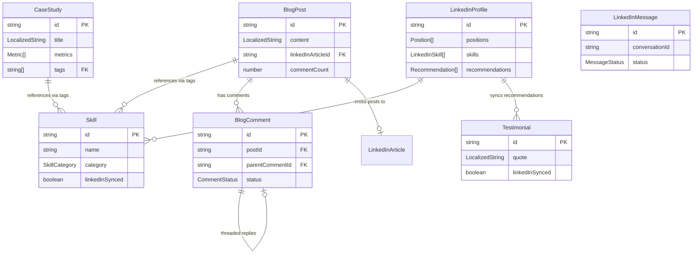

# Data Model

**Feature**: 001-modern-portfolio  
**Version**: 2.0  
**Last Updated**: 2025-11-03

## Overview

This document defines the data model for the Modern Portfolio website, implementing a **hybrid architecture** with Astro (static portfolio) and TanStack Start (dynamic blog). The model supports bilingual content (English/Spanish), LinkedIn Messaging API integration, blog functionality with server-side features, and comprehensive portfolio presentation.

## Design Principles

1. **Hybrid Architecture**: Data structures support both static generation (Astro) and dynamic features (TanStack Start)
2. **Content-First**: Data structures prioritize content delivery and SEO optimization
3. **Bilingual Support**: All user-facing content supports English/Spanish localization
4. **Performance-Oriented**: Data structures optimized for caching and minimal payload sizes
5. **Type-Safe**: All entities designed for TypeScript strict mode with Zod validation
6. **API-Ready**: Entities map cleanly to REST/GraphQL contracts
7. **Extensible**: Schema allows for future additions without breaking changes

---

## Architecture Context

### Astro (Static Portfolio)
- **Entities**: CaseStudy, Skill, Testimonial, LinkedInProfile (cached)
- **Storage**: File-based (JSON/MDX)
- **Build**: Static Site Generation (SSG)

### TanStack Start (Dynamic Blog)
- **Entities**: BlogPost, BlogComment, LinkedInMessage
- **Storage**: Server functions + database/edge storage
- **Rendering**: Server-Side Rendering (SSR) with streaming

---

## Core Entities

### 1. CaseStudy

**Purpose**: Represents a project showcase with detailed context, outcomes, and supporting assets.  
**Architecture**: Astro static site (SSG)

**Schema**:

```typescript
interface CaseStudy {
  id: string;                          // Unique identifier (slug format: "karla-v2")
  title: LocalizedString;              // Project name
  role: LocalizedString;               // Developer's role (e.g., "Technical Lead")
  context: LocalizedString;            // Business/project context
  problem: LocalizedString;            // Challenge or problem statement
  approach: LocalizedString;           // Solution approach and methodology
  outcomes: LocalizedString;           // Results and achievements
  metrics: Metric[];                   // Quantifiable outcomes
  tags: string[];                      // Technology/domain tags (e.g., ["React", "Serverless", "Healthcare"])
  architectureDiagramImage: ImageAsset; // Primary architecture diagram
  gallery?: ImageAsset[];              // Optional additional images
  featured: boolean;                   // Whether to feature on home page
  order: number;                       // Display order
  publishedAt: Date;                   // Publication date
  lastModified: Date;                  // Last update timestamp
}

interface Metric {
  label: LocalizedString;              // Metric description (e.g., "Cost Reduction")
  value: string;                       // Formatted value (e.g., "67%", "$45K saved")
  icon?: string;                       // Optional icon identifier
}

interface LocalizedString {
  en: string;                          // English content
  es: string;                          // Spanish content
}

interface ImageAsset {
  src: string;                         // Image URL or path
  alt: LocalizedString;                // Accessible alt text
  width?: number;                      // Intrinsic width (pixels)
  height?: number;                     // Intrinsic height (pixels)
  caption?: LocalizedString;           // Optional caption
  credit?: string;                     // Optional image credit
}
```

**Validation Rules** (Zod):

```typescript
import { z } from 'zod';

const LocalizedStringSchema = z.object({
  en: z.string().min(1, "English content required"),
  es: z.string().min(1, "Spanish content required")
});

const ImageAssetSchema = z.object({
  src: z.string().url("Must be valid URL or path"),
  alt: LocalizedStringSchema,
  width: z.number().positive().optional(),
  height: z.number().positive().optional(),
  caption: LocalizedStringSchema.optional(),
  credit: z.string().optional()
});

const MetricSchema = z.object({
  label: LocalizedStringSchema,
  value: z.string().min(1, "Metric value required"),
  icon: z.string().optional()
});

const CaseStudySchema = z.object({
  id: z.string().regex(/^[a-z0-9-]+$/, "Must be slug format"),
  title: LocalizedStringSchema,
  role: LocalizedStringSchema,
  context: LocalizedStringSchema,
  problem: LocalizedStringSchema,
  approach: LocalizedStringSchema,
  outcomes: LocalizedStringSchema,
  metrics: z.array(MetricSchema).min(1, "At least one metric required"),
  tags: z.array(z.string()).min(1, "At least one tag required"),
  architectureDiagramImage: ImageAssetSchema,
  gallery: z.array(ImageAssetSchema).optional(),
  featured: z.boolean().default(false),
  order: z.number().int().nonnegative(),
  publishedAt: z.date(),
  lastModified: z.date()
});
```

**Storage**: File-based (JSON/MDX with frontmatter) in `portfolio/src/data/case-studies/`

**Relationships**:
- None (self-contained entity)

---

### 2. Skill

**Purpose**: Represents technical or professional competency with categorization and proficiency indication.  
**Architecture**: Astro static site (SSG) with optional LinkedIn sync

**Schema**:

```typescript
interface Skill {
  id: string;                          // Unique identifier (e.g., "react")
  name: string;                        // Technology/skill name (e.g., "React")
  category: SkillCategory;             // Grouping category
  description?: LocalizedString;       // Optional detailed description
  proficiency: ProficiencyLevel;       // Skill level
  yearsOfExperience?: number;          // Years working with this skill
  relatedTags: string[];               // Related technologies or domains
  highlighted: boolean;                // Whether to emphasize in UI
  order: number;                       // Display order within category
  linkedInSynced: boolean;             // Whether synced from LinkedIn
  lastUsed?: Date;                     // Most recent professional use
}

enum SkillCategory {
  FRONTEND = "frontend",
  BACKEND = "backend",
  CLOUD_DEVOPS = "cloud_devops",
  SECURITY = "security",
  LEADERSHIP = "leadership",
  TOOLS = "tools"
}

enum ProficiencyLevel {
  EXPERT = "expert",         // 5/5 - Deep expertise, can architect solutions
  ADVANCED = "advanced",     // 4/5 - Highly proficient, production-ready
  INTERMEDIATE = "intermediate", // 3/5 - Comfortable, can work independently
  BASIC = "basic",           // 2/5 - Foundational knowledge
  FAMILIAR = "familiar"      // 1/5 - Exposure, learning
}
```

**Validation Rules** (Zod):

```typescript
const SkillCategorySchema = z.enum([
  "frontend",
  "backend",
  "cloud_devops",
  "security",
  "leadership",
  "tools"
]);

const ProficiencyLevelSchema = z.enum([
  "expert",
  "advanced",
  "intermediate",
  "basic",
  "familiar"
]);

const SkillSchema = z.object({
  id: z.string().regex(/^[a-z0-9-]+$/, "Must be slug format"),
  name: z.string().min(1, "Skill name required"),
  category: SkillCategorySchema,
  description: LocalizedStringSchema.optional(),
  proficiency: ProficiencyLevelSchema,
  yearsOfExperience: z.number().int().nonnegative().optional(),
  relatedTags: z.array(z.string()).default([]),
  highlighted: z.boolean().default(false),
  order: z.number().int().nonnegative(),
  linkedInSynced: z.boolean().default(false),
  lastUsed: z.date().optional()
});
```

**Storage**: File-based (JSON) in `portfolio/src/data/skills/skills.json`

**Relationships**:
- Can be referenced by `CaseStudy.tags`
- Synced from LinkedIn API (optional)

---

### 3. Testimonial

**Purpose**: Client/colleague endorsement with attribution and permission tracking.  
**Architecture**: Astro static site (SSG) with optional LinkedIn sync

**Schema**:

```typescript
interface Testimonial {
  id: string;                          // Unique identifier
  quote: LocalizedString;              // Testimonial text
  sourceName: string;                  // Person's name (or "Anonymous")
  roleOrRelationship: LocalizedString; // Job title/relationship context
  organization?: string;               // Company/organization name
  permissionGranted: boolean;          // Whether full attribution approved
  linkedInProfile?: string;            // Optional LinkedIn profile URL
  avatarUrl?: string;                  // Optional profile image
  date?: Date;                         // When testimonial was given
  featured: boolean;                   // Whether to feature prominently
  order: number;                       // Display order
  linkedInSynced: boolean;             // Whether synced from LinkedIn recommendations
}
```

**Validation Rules** (Zod):

```typescript
const TestimonialSchema = z.object({
  id: z.string().uuid("Must be valid UUID"),
  quote: LocalizedStringSchema,
  sourceName: z.string().min(1, "Source name required"),
  roleOrRelationship: LocalizedStringSchema,
  organization: z.string().optional(),
  permissionGranted: z.boolean(),
  linkedInProfile: z.string().url().optional(),
  avatarUrl: z.string().url().optional(),
  date: z.date().optional(),
  featured: z.boolean().default(false),
  order: z.number().int().nonnegative(),
  linkedInSynced: z.boolean().default(false)
});
```

**Storage**: File-based (JSON) in `portfolio/src/data/testimonials/testimonials.json`

**Relationships**:
- May be synced from LinkedIn API recommendations
- If `permissionGranted === false`, display anonymized attribution

---

### 4. LinkedInMessage

**Purpose**: Captures LinkedIn messaging interactions via OAuth API with conversation tracking.  
**Architecture**: TanStack Start server functions (SSR)

**Schema**:

```typescript
interface LinkedInMessage {
  id: string;                          // Unique identifier (UUID)
  conversationId?: string;             // LinkedIn conversation thread ID
  senderId: string;                    // User ID (LinkedIn or anonymous)
  recipientId: string;                 // Portfolio owner's LinkedIn ID
  subject: string;                     // Message subject line
  message: string;                     // Message content
  sentAt: Date;                        // Submission timestamp
  locale: string;                      // Language at time of submission (en/es)
  status: MessageStatus;               // Delivery/read status
  deliveredAt?: Date;                  // When LinkedIn delivered message
  readAt?: Date;                       // When recipient read message
  linkedInMessageId?: string;          // LinkedIn API message ID
  userAgent?: string;                  // Browser user agent
  source: string;                      // Source (e.g., "portfolio-contact-widget")
  metadata: MessageMetadata;           // Additional context
  error?: string;                      // Error message if delivery failed
}

enum MessageStatus {
  PENDING = "pending",         // Awaiting LinkedIn API call
  SENT = "sent",               // Successfully sent via API
  DELIVERED = "delivered",     // LinkedIn confirmed delivery
  READ = "read",               // Recipient read the message
  FAILED = "failed",           // LinkedIn API error
  FALLBACK = "fallback"        // Used Share API fallback
}

interface MessageMetadata {
  linkedInAuthToken?: string;          // OAuth token (encrypted at rest)
  authMethod: 'oauth' | 'share_api';   // Which API method was used
  retryCount: number;                  // Number of retry attempts
  fallbackUsed: boolean;               // Whether fallback to Share API was triggered
  ipAddressHash?: string;              // Hashed IP address for abuse prevention
}
```

**Validation Rules** (Zod):

```typescript
const MessageStatusSchema = z.enum([
  "pending",
  "sent",
  "delivered",
  "read",
  "failed",
  "fallback"
]);

const MessageMetadataSchema = z.object({
  linkedInAuthToken: z.string().optional(),
  authMethod: z.enum(['oauth', 'share_api']),
  retryCount: z.number().int().nonnegative().default(0),
  fallbackUsed: z.boolean().default(false),
  ipAddressHash: z.string().optional()
});

const LinkedInMessageSchema = z.object({
  id: z.string().uuid("Must be valid UUID"),
  conversationId: z.string().optional(),
  senderId: z.string().min(1, "Sender ID required"),
  recipientId: z.string().min(1, "Recipient ID required"),
  subject: z.string().min(1, "Subject required")
    .max(200, "Subject too long"),
  message: z.string().min(10, "Message must be at least 10 characters")
    .max(5000, "Message too long"),
  sentAt: z.date(),
  locale: z.enum(["en", "es"]),
  status: MessageStatusSchema.default("pending"),
  deliveredAt: z.date().optional(),
  readAt: z.date().optional(),
  linkedInMessageId: z.string().optional(),
  userAgent: z.string().optional(),
  source: z.string().default("portfolio-contact-widget"),
  metadata: MessageMetadataSchema,
  error: z.string().optional()
});
```

**Storage**: TanStack Start server-side storage (database/edge storage like Netlify Blobs or D1)

**Relationships**:
- Linked to LinkedIn OAuth session
- Part of conversation thread (conversationId)

**Privacy Considerations**:
- OAuth tokens must be encrypted at rest
- IP addresses must be hashed before storage
- Personal data retention: 2 years maximum
- GDPR/CCPA compliance: support data export and deletion requests
- No data sharing with third parties

---

### 5. BlogPost

**Purpose**: Represents technical articles with rich metadata, multi-language support, and dynamic features.  
**Architecture**: TanStack Start (SSR) with MDX content

**Schema**:

```typescript
interface BlogPost {
  id: string;                          // Unique identifier (slug format)
  slug: LocalizedString;               // URL-friendly slug per language
  title: LocalizedString;              // Post title
  description: LocalizedString;        // Meta description / excerpt
  content: LocalizedString;            // Full markdown/MDX content
  publishDate: Date;                   // Publication date
  lastModified: Date;                  // Last update timestamp
  author: Author;                      // Author information
  tags: string[];                      // Categorization tags
  categories: string[];                // Content categories
  language: string;                    // Primary language (en/es)
  status: PostStatus;                  // Publication status
  readingTimeMinutes: number;          // Estimated reading time
  linkedInArticleId?: string;          // LinkedIn article ID (if synced)
  canonicalUrl: string;                // Canonical URL for SEO
  coverImage?: ImageAsset;             // Featured image
  featured: boolean;                   // Whether to feature on blog home
  viewCount?: number;                  // Page view count
  commentCount?: number;               // Number of approved comments
  seo: SEOMetadata;                    // SEO optimization data
}

interface Author {
  name: string;                        // Author full name
  bio?: LocalizedString;               // Short bio
  avatarUrl?: string;                  // Profile image
  linkedInUrl?: string;                // LinkedIn profile
  twitterHandle?: string;              // Twitter/X handle
}

enum PostStatus {
  DRAFT = "draft",             // Work in progress
  PUBLISHED = "published",     // Live on site
  SCHEDULED = "scheduled",     // Scheduled for future
  ARCHIVED = "archived"        // Removed from listing
}

interface SEOMetadata {
  title?: LocalizedString;             // Custom SEO title (overrides post title)
  description?: LocalizedString;       // Custom meta description
  keywords: string[];                  // SEO keywords
  ogImage?: string;                    // Open Graph image URL
  noIndex: boolean;                    // Whether to exclude from indexing
}
```

**Validation Rules** (Zod):

```typescript
const AuthorSchema = z.object({
  name: z.string().min(1, "Author name required"),
  bio: LocalizedStringSchema.optional(),
  avatarUrl: z.string().url().optional(),
  linkedInUrl: z.string().url().optional(),
  twitterHandle: z.string().regex(/^@?[a-zA-Z0-9_]{1,15}$/).optional()
});

const PostStatusSchema = z.enum([
  "draft",
  "published",
  "scheduled",
  "archived"
]);

const SEOMetadataSchema = z.object({
  title: LocalizedStringSchema.optional(),
  description: LocalizedStringSchema.optional(),
  keywords: z.array(z.string()).default([]),
  ogImage: z.string().url().optional(),
  noIndex: z.boolean().default(false)
});

const BlogPostSchema = z.object({
  id: z.string().regex(/^[a-z0-9-]+$/, "Must be slug format"),
  slug: LocalizedStringSchema,
  title: LocalizedStringSchema,
  description: LocalizedStringSchema,
  content: LocalizedStringSchema,
  publishDate: z.date(),
  lastModified: z.date(),
  author: AuthorSchema,
  tags: z.array(z.string()).min(1, "At least one tag required"),
  categories: z.array(z.string()).min(1, "At least one category required"),
  language: z.enum(["en", "es"]),
  status: PostStatusSchema,
  readingTimeMinutes: z.number().int().positive(),
  linkedInArticleId: z.string().optional(),
  canonicalUrl: z.string().url(),
  coverImage: ImageAssetSchema.optional(),
  featured: z.boolean().default(false),
  viewCount: z.number().int().nonnegative().optional(),
  commentCount: z.number().int().nonnegative().default(0),
  seo: SEOMetadataSchema
});
```

**Storage**: MDX files with frontmatter in `blog/content/posts/{locale}/{slug}.mdx`

**Relationships**:
- May be synced to LinkedIn via Publishing API
- Related to `Skill.relatedTags` for content recommendations
- Has many `BlogComment` entries

---

### 6. BlogComment

**Purpose**: User comments on blog posts with moderation support.  
**Architecture**: TanStack Start server functions (SSR)

**Schema**:

```typescript
interface BlogComment {
  id: string;                          // Unique identifier (UUID)
  postId: string;                      // Associated blog post ID
  authorName: string;                  // Commenter's name
  authorEmail: string;                 // Commenter's email (not displayed)
  authorWebsite?: string;              // Optional website URL
  content: string;                     // Comment text
  postedAt: Date;                      // Submission timestamp
  status: CommentStatus;               // Moderation status
  parentCommentId?: string;            // For threaded replies
  ipAddressHash: string;               // Hashed IP for spam prevention
  userAgent?: string;                  // Browser user agent
  locale: string;                      // Language (en/es)
  upvotes: number;                     // Community upvotes
  flagCount: number;                   // User-reported flags
  moderatedBy?: string;                // Admin user ID who moderated
  moderatedAt?: Date;                  // Moderation timestamp
  editedAt?: Date;                     // Last edit timestamp
}

enum CommentStatus {
  PENDING = "pending",         // Awaiting moderation
  APPROVED = "approved",       // Visible to public
  REJECTED = "rejected",       // Rejected by moderator
  SPAM = "spam",               // Marked as spam
  DELETED = "deleted"          // Deleted by author or admin
}
```

**Validation Rules** (Zod):

```typescript
const CommentStatusSchema = z.enum([
  "pending",
  "approved",
  "rejected",
  "spam",
  "deleted"
]);

const BlogCommentSchema = z.object({
  id: z.string().uuid("Must be valid UUID"),
  postId: z.string().regex(/^[a-z0-9-]+$/, "Must be valid post ID"),
  authorName: z.string().min(2, "Name must be at least 2 characters")
    .max(100, "Name too long"),
  authorEmail: z.string().email("Must be valid email address"),
  authorWebsite: z.string().url().optional(),
  content: z.string().min(1, "Comment cannot be empty")
    .max(2000, "Comment too long"),
  postedAt: z.date(),
  status: CommentStatusSchema.default("pending"),
  parentCommentId: z.string().uuid().optional(),
  ipAddressHash: z.string().min(1, "IP hash required"),
  userAgent: z.string().optional(),
  locale: z.enum(["en", "es"]),
  upvotes: z.number().int().nonnegative().default(0),
  flagCount: z.number().int().nonnegative().default(0),
  moderatedBy: z.string().optional(),
  moderatedAt: z.date().optional(),
  editedAt: z.date().optional()
});
```

**Storage**: TanStack Start server-side storage (database/edge storage)

**Relationships**:
- Belongs to one `BlogPost` (via postId)
- Can have parent comment (threaded replies)

**Privacy Considerations**:
- Email addresses never displayed publicly
- IP addresses must be hashed before storage
- Support GDPR deletion requests
- Auto-delete spam comments after 90 days

---

### 7. LinkedInProfile

**Purpose**: Cached LinkedIn profile data to reduce API calls and ensure performance targets.  
**Architecture**: Build-time or edge-cached data

**Schema**:

```typescript
interface LinkedInProfile {
  id: string;                          // LinkedIn profile ID
  firstName: string;                   // First name
  lastName: string;                    // Last name
  headline: string;                    // Professional headline
  summary?: string;                    // Profile summary/about
  profilePictureUrl?: string;          // Profile image URL
  positions: Position[];               // Work experience
  skills: LinkedInSkill[];             // Skill endorsements
  recommendations: Recommendation[];   // Received recommendations
  lastFetched: Date;                   // Cache timestamp
  cacheExpiry: Date;                   // When to refresh
}

interface Position {
  title: string;                       // Job title
  companyName: string;                 // Company name
  companyLogoUrl?: string;             // Company logo
  startDate: Date;                     // Start date
  endDate?: Date;                      // End date (null if current)
  description?: string;                // Role description
  location?: string;                   // Job location
}

interface LinkedInSkill {
  name: string;                        // Skill name
  endorsementCount: number;            // Number of endorsements
}

interface Recommendation {
  text: string;                        // Recommendation text
  recommenderName: string;             // Recommender's name
  recommenderTitle?: string;           // Their job title
  recommenderProfileUrl?: string;      // Their LinkedIn profile
  date: Date;                          // When recommendation was given
}
```

**Validation Rules** (Zod):

```typescript
const PositionSchema = z.object({
  title: z.string().min(1),
  companyName: z.string().min(1),
  companyLogoUrl: z.string().url().optional(),
  startDate: z.date(),
  endDate: z.date().optional(),
  description: z.string().optional(),
  location: z.string().optional()
});

const LinkedInSkillSchema = z.object({
  name: z.string().min(1),
  endorsementCount: z.number().int().nonnegative()
});

const RecommendationSchema = z.object({
  text: z.string().min(1),
  recommenderName: z.string().min(1),
  recommenderTitle: z.string().optional(),
  recommenderProfileUrl: z.string().url().optional(),
  date: z.date()
});

const LinkedInProfileSchema = z.object({
  id: z.string().min(1),
  firstName: z.string().min(1),
  lastName: z.string().min(1),
  headline: z.string().min(1),
  summary: z.string().optional(),
  profilePictureUrl: z.string().url().optional(),
  positions: z.array(PositionSchema),
  skills: z.array(LinkedInSkillSchema),
  recommendations: z.array(RecommendationSchema),
  lastFetched: z.date(),
  cacheExpiry: z.date()
});
```

**Storage**: Server-side cache (Netlify Edge Functions cache, Redis, or static JSON at build time)

**Relationships**:
- Maps to `Skill` entities (sync skill names and endorsements)
- Maps to `Testimonial` entities (sync recommendations)

**Caching Strategy**:
- **TTL**: 24 hours for profile data, 7 days for positions/recommendations
- **Refresh**: Background job refreshes before expiry
- **Fallback**: Use stale data if API unavailable, display warning banner

---

## Entity Relationships



---

## Data Access Patterns

### 1. Homepage Data Loading (Astro Static)

**Requirement**: Load featured case studies, skills summary, and testimonials  
**Performance Target**: LCP ≤ 2.5s  
**Strategy**: Static generation at build time

```typescript
// Astro component data loading
const homepageData = {
  featuredCaseStudies: await getCaseStudies({ featured: true, limit: 3 }),
  skillsSummary: await getSkillsByCategory({ highlighted: true }),
  testimonials: await getTestimonials({ featured: true, limit: 3 })
};
```

### 2. Blog Listing (TanStack Start SSR)

**Requirement**: Paginated, filterable blog posts with real-time comment counts  
**Performance Target**: JS ≤ 200KB per route, TTI ≤ 2s  
**Strategy**: Server-side rendering with client-side filtering

```typescript
// TanStack Start server function
const getBlogPostsServerFn = createServerFn('GET', async (params) => {
  const posts = await db.blogPosts.findMany({
    where: {
      status: 'published',
      locale: params.locale,
      tags: { hasSome: params.filterTags }
    },
    include: {
      _count: { select: { comments: true } }
    },
    skip: (params.page - 1) * 10,
    take: 10
  });
  
  return {
    posts,
    totalCount: await db.blogPosts.count({ where: { status: 'published' } })
  };
});
```

### 3. LinkedIn Message Submission (TanStack Start)

**Requirement**: Send message via LinkedIn API with OAuth, fallback to Share API  
**Performance Target**: Response time ≤ 3s, 99% success rate  
**Strategy**: Server function with OAuth token validation and retry logic

```typescript
// TanStack Start server function
const sendLinkedInMessageFn = createServerFn('POST', async (data) => {
  // Validate OAuth token
  const isValid = await validateLinkedInToken(data.authToken);
  
  if (isValid) {
    try {
      // Primary: Use LinkedIn Messaging API
      const result = await sendViaMessagingAPI(data);
      return { success: true, method: 'oauth', messageId: result.id };
    } catch (error) {
      // Fallback: Use Share API
      const fallbackUrl = generateShareAPIUrl(data.message);
      return { success: true, method: 'share_api', fallbackUrl };
    }
  }
  
  // No OAuth: Direct to Share API
  const fallbackUrl = generateShareAPIUrl(data.message);
  return { success: true, method: 'share_api', fallbackUrl };
});
```

### 4. Blog Comments (TanStack Start)

**Requirement**: Real-time comment submission with spam prevention  
**Performance Target**: Submit ≤ 1s, moderation queue updates real-time  
**Strategy**: Server function with validation, spam filtering, and moderation queue

```typescript
// TanStack Start server function
const submitCommentFn = createServerFn('POST', async (data) => {
  // Spam check
  const isSpam = await checkSpam(data.content, data.ipAddressHash);
  
  if (isSpam) {
    return { success: false, error: 'Comment flagged as spam' };
  }
  
  // Save comment with pending status
  const comment = await db.blogComments.create({
    data: {
      ...data,
      status: 'pending',
      ipAddressHash: hashIP(data.ipAddress)
    }
  });
  
  // Notify moderators
  await notifyModerators(comment.id);
  
  return { success: true, commentId: comment.id };
});
```

### 5. LinkedIn Profile Sync

**Requirement**: Fresh profile data without API latency  
**Performance Target**: No blocking API calls on page load  
**Strategy**: Background sync with cached fallback

```typescript
// Cache-first pattern (Astro or TanStack Start)
const linkedInData = await getCachedLinkedInProfile();
if (linkedInData && !isExpired(linkedInData)) {
  return linkedInData;
}

// Background refresh (non-blocking)
scheduleLinkedInRefresh();
return linkedInData || fallbackData;
```

---

## Validation Summary

All entities implement:
- **Type safety**: TypeScript strict mode compliance
- **Runtime validation**: Zod schema validation at API boundaries
- **Localization**: `LocalizedString` for all user-facing content
- **Accessibility**: `alt` text and semantic structure
- **SEO**: Metadata fields for search optimization
- **Performance**: Indexed queries and caching strategies
- **Security**: Input sanitization, hashed PII, encrypted OAuth tokens

---

## Storage Strategy by Architecture

### Astro (Static Portfolio)
- **CaseStudy**: JSON/MDX files in `portfolio/src/data/case-studies/`
- **Skill**: JSON in `portfolio/src/data/skills/skills.json`
- **Testimonial**: JSON in `portfolio/src/data/testimonials/testimonials.json`
- **LinkedInProfile**: Cached JSON generated at build time

### TanStack Start (Dynamic Blog)
- **BlogPost**: MDX files with frontmatter in `blog/content/posts/{locale}/`
- **BlogComment**: Database (PostgreSQL, MySQL) or edge storage (D1, Turso)
- **LinkedInMessage**: Database or Netlify Blobs for serverless

---

## Migration & Versioning

**Current Version**: 2.0  
**Breaking Changes**: 
- Removed `ContactSubmission` entity (replaced by `LinkedInMessage`)
- Added `BlogComment` entity for dynamic blog features
- Updated `BlogPost` to include `commentCount`

**Backward Compatibility**: 
- API contracts follow semantic versioning
- Old `ContactSubmission` data can be migrated to `LinkedInMessage` format

**Future Considerations**:
- Add `VideoAsset` type for case study videos
- Expand `BlogPost.seo` for structured data (JSON-LD)
- Add `Project` entity separate from `CaseStudy` for smaller work samples
- Implement full-text search index for blog content
- Add real-time notifications for comment moderation

---

## Compliance & Privacy

**GDPR Compliance**:
- `LinkedInMessage`: Right to access, rectify, delete
- `BlogComment`: Right to access, rectify, delete
- `LinkedInProfile`: User owns data sync preferences
- `BlogPost.viewCount`: Anonymous, no PII tracking

**Data Retention**:
- `LinkedInMessage`: 2 years, then auto-archive
- `BlogComment`: Indefinite for approved, 90 days for spam/rejected
- `LinkedInProfile`: Refresh on-demand, no indefinite storage
- Logs: 90 days maximum

**Security**:
- All PII encrypted at rest
- OAuth tokens encrypted and rotated
- API rate limiting to prevent abuse
- Input sanitization for XSS/injection prevention
- CSRF protection on all form submissions
- IP address hashing for privacy